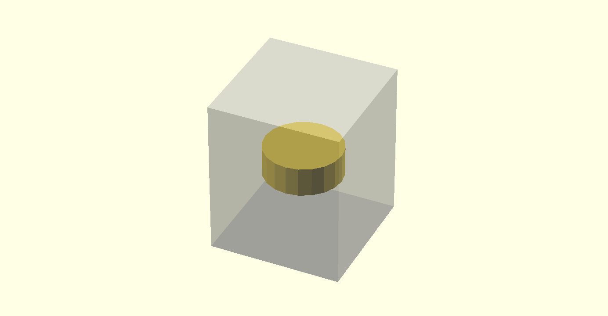
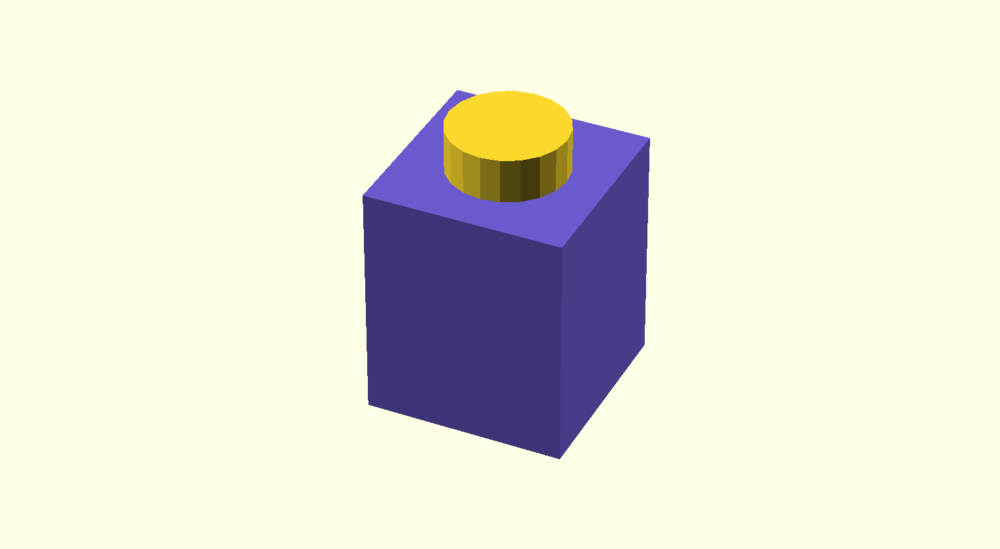
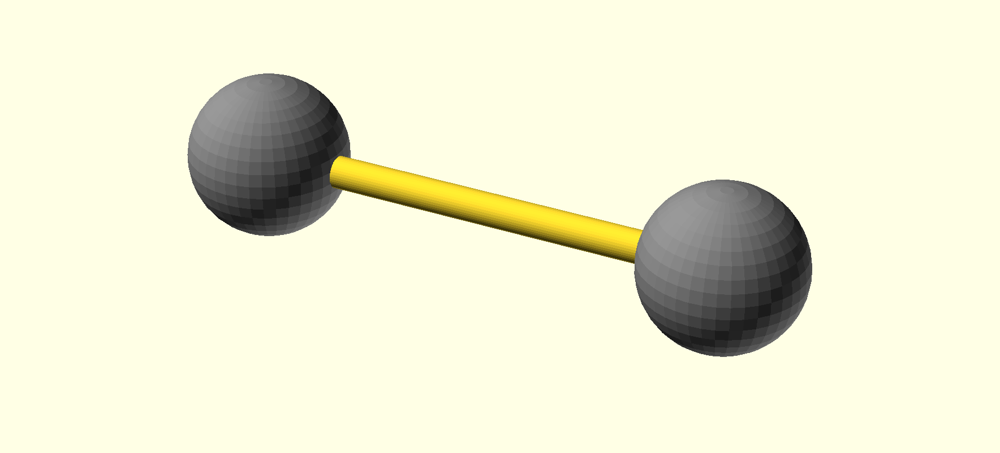
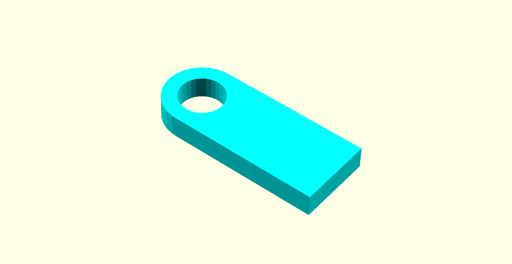

## 3D Forms

> It is not hard to understand modern art. If it hangs on a wall it's a painting, and if you can walk around it it's a sculpture

Tom Stoppard, author of [Rosencrantz & Guildenstern are Dead](Rosencrantz & Guildenstern Are Dead){attrib}

This chapter explores creating 3D forms 

- another dimension, volume, point of view
- much of our world is 3D, and much of of our art is a representation that suggests real things. 3D forms can be these things.
- actually make something
- virtually make something is pretty good too
- speed (immediate gratification)
- scale(huge trees)


## OpenSCAD

[OpenSCAD](http://www.openscad.org/about.html) is a language for specifying procedural 3D forms using [constructive solid geometry](https://en.wikipedia.org/wiki/Constructive_solid_geometry). CSG is a modeling technique in which complex shapes are created by combining simple shapes using boolean operations like union, difference, and intersection. It is well suited to designing mechanical parts for manufacturing, but not well suited for organic shapes, characters, or animation. OpenSCAD is a language, not an interactive modeler, and OpenSCAD files fully specify the modeling process rather than the just the resulting geometry. Because of this, OpenSCAD is well-suited to specifying parametric designs.

[OpenSCAD.org](http://www.openscad.org/)
: Main site for OpenSCAD. IDE Download, Documentation, Examples.

[CheatSheet](http://www.openscad.org/cheatsheet/index.html)
: A quick index of OpenSCAD's syntax and library.

[Manual](https://en.wikibooks.org/wiki/OpenSCAD_User_Manual)
: The specifics of the OpenSCAD IDE and language.

[OpenSCAD.net](http://openscad.net/)
: A web-based OpenSCAD editor and renderer. Does not implement every feature of OpenSCAD.

### Functional and Declarative

::: .links-sidebar
[Wikipeda:<br/>Programming Paradigms](https://en.wikipedia.org/wiki/Programming_paradigm)

[Talk:<br/>4 Paradigms in 40 Minutes](https://www.youtube.com/watch?v=cgVVZMfLjEI)
/::

The [OpenSCAD Manual](https://en.wikibooks.org/wiki/OpenSCAD_User_Manual/The_OpenSCAD_Language) describes OpenSCAD as a [functional](https://en.wikipedia.org/wiki/Functional_programming) programming language. One could more generally refer to OpenSCAD as a [declarative](https://en.wikipedia.org/wiki/Declarative_programming) language. In contrast to JavaScript, C, and Processing, it is not an [imperative](https://en.wikipedia.org/wiki/Imperative_programming) or [procedural](https://en.wikipedia.org/wiki/Procedural_programming) language.

| paradigm    | description                                                                                        |
| ----------- | -------------------------------------------------------------------------------------------------- |
| imperative  | focuses on the steps needed to achieve a goal; ordered commands, mutable program state               |
| procedural  | an imperative approach that primarily organizes commands using procedures                          |
| declarative | focuses on what you want to achieve rather than the steps to achieve it; unordered                |
| functional  | a declarative approach that organizes logic using pure functions; no side effects, immutable state |

The most noticeable effect of OpenSCAD being functional is that data in OpenSCAD is not immutable: the value of every variable is constant. In fact, variables are not even assigned values at runtime. A variable's value is determined and assigned at compile time, before the script is run. If you keep this in mind, data in OpenSCAD will make more sense. The OpenSCAD manual goes into more detail about how [variables](https://en.wikibooks.org/wiki/OpenSCAD_User_Manual/The_OpenSCAD_Language#Variables) behave.

<!--[["data in OpenScad is not immutable" --Should this be "data in OpenScad is immutable?" If the sentence is correct, "data is mutable" would be clearer. Overall, I had trouble parsing the chart of paradigms and this description. Grouping (by color?) imperative/procedural and declarative/functional might help, rather than presenting them as four equal paradigms?]]-->

### Infix vs. Prefix Notation

Javascript expression with infix notation
```javascript
2 * 3 -> 6
2 * 3 * 4 -> 24
```

Lisp expressions with prefix notation
```lisp
(* 2 3) -> 6
(* 2 3 4) - 24
```

Prefix notation isn't that crazy. Compare it to function calls in JavaScript.
```javascript
multiply(2, 3) -> 6
multiply(2, 3, 4) -> 24
```

You can think of OpenSCAD's boolean and transform operations as prefix operators or function calls. Unlike JavaScript and C, the contents of `{}` are operands: parameters rather than commands. 
```javascript
union() {
    cylinder (h=4, r=1, center = true);
    rotate ([90,0,0]) cylinder (h=4, r=1, center=true);
}
```

### Named Parameters

OpenSCAD with named parameters
```javascript
cylinder (h=4, r=1, center = true);
```

OpenSCAD with positional parameters
```javascript
cylinder (4, 1, 1, true);
```

Javascript emulating named params with an object literal
```javascript
cylinder ({h=4, r=1, center=true});
```


### JavaScript Options

OpenSCAD's functional model has its advantages, but imperative languages also have advantages. For one, imperative languages are more familiar to many programmers. To explore procedural constructive solid geometry modeling in an imperative style, you may want to use one of these tools inspired by OpenSCAD.

[OpenJSCAD](http://joostn.github.io/OpenJsCad/)
: Web-based solid modeling in JavaScript. OpenSCAD but in JS.

[OpenJSCAD.org IDE](https://openjscad.org/) [OpenJSCAD.org repo](https://github.com/jscad/OpenJSCAD.org)
: A web-based IDE built on OpenJSCAD.

[OpenJSCAD.org User and Programming Guide](https://en.wikibooks.org/wiki/OpenJSCAD_User_Guide)
: Manual for OpenJSCAD syntax and library.


## Study Examples

These examples will build up to a simplified parametric Lego brick. To get started we'll need the [dimensions of a Lego brick](https://www.cailliau.org/Lego/Dimensions/zMeasurements-en.xhtml).


### Generating Primitives

```openscad
$fn = 20;
% cube([8,8,9.6], true);
cylinder(h=1.8, r=2.4, center=true);
```

{full-width}


### $fn, $fa, $fs

### %, #, *, !

### echo

### Transformations
```openscad
$fn = 20;

color("SlateBlue") {
    cube([8,8,9.6], true);
}

translate([0, 0, 9.6 * .5 + 1.8 * .5]) {
    cylinder(h=1.8, r=2.4, center=true);
}
```
{full-width}

`Translate()` moves the shapes passed to it. Here translate moves the cylinder up. Notice that the braces are used to group parameters to translate.

The example also demonstrates using `color` to change the color used to render the cube. Use color to make it easier to understand your model.

### Boolean Operations

```openscad
$fn = 20;

difference() {
    union() {
        cube([8,8,9.6], true);
        translate([0,0,9.6 * .5 + 1.8 * .5]) {
            cylinder(h=1.8, r=2.4, center=true);
        }
    }
    translate([0,0, -9.6 * .5 + 1.8 * .5]) {
        cylinder(h=1.8, r=2.4, center=true);
    }
}
```
{full-width}

This example uses `difference()` and `union()` to combine shapes. A cylinder and cube are combined with `union()`. The resulting shape has a recess cut out using `difference()`.

OpenSCAD may not preview this shape very cleanly. Render the shape with `Main Menu > Design > Render` to get a clear view of the rendered geometry.

### Variables + Modules

```openscad
$fn = 20;
brick_width = 8;
brick_height = 9.6;
knob_radius = 2.4;
knob_height = 1.8;

module unit_brick () {
    difference() {
        union() {
            cube([brick_width, brick_width, brick_height], true);
            translate([0, 0, (brick_height + knob_height) * .5]) {
                cylinder(h=knob_height, r=knob_radius, center=true);
            }
        }
        translate([0,0, (-brick_height + knob_height) * .5]) {
            cylinder(h=knob_height, r=knob_radius, center=true);
        }
    }
}

unit_brick();
```

This example produces the same shape as the example above, but uses variables and a module definition to make the code easier to read.


### For Loops

```openscad
$fn = 20;
brick_width = 8;
brick_height = 9.6;
knob_radius = 2.4;
knob_height = 1.8;
rows = 2;
columns = 8;


module unit_brick () {
    difference() {
        union() {
            cube([brick_width, brick_width, brick_height], true);
            translate([0, 0, (brick_height + knob_height) * .5]) {
                cylinder(h=knob_height, r=knob_radius, center=true);
            }
        }
        translate([0,0, (-brick_height + knob_height) * .5]) {
            cylinder(h=knob_height, r=knob_radius, center=true);
        }
    }
}


for (x = [0:columns-1], y = [0:rows-1]) {
    translate([x * brick_width, y * brick_width, 0]) {
        unit_brick();
    }
}

```
{full-width}

This example uses `for` to create several instances of our basic shape. OpenSCAD's `for()` looks a lot like the imperative flow control structure, but [works differently](https://en.wikibooks.org/wiki/OpenSCAD_User_Manual/Conditional_and_Iterator_Functions#For_Loop) because OpenSCAD is functional. Each instance is created in its own scope and no data can flow between scopes. The syntax also allows "iterating" over multiple variables at once. This example will create a unit brick for every combination of x and y. In javascript you would need a nested pair of loops. Also, note that the for loop implicitly `union()`s the shapes.


::: .activity
## In-class Challenge

Try creating OpenSCAD scripts for each of these shapes.





/::


## Assignment


