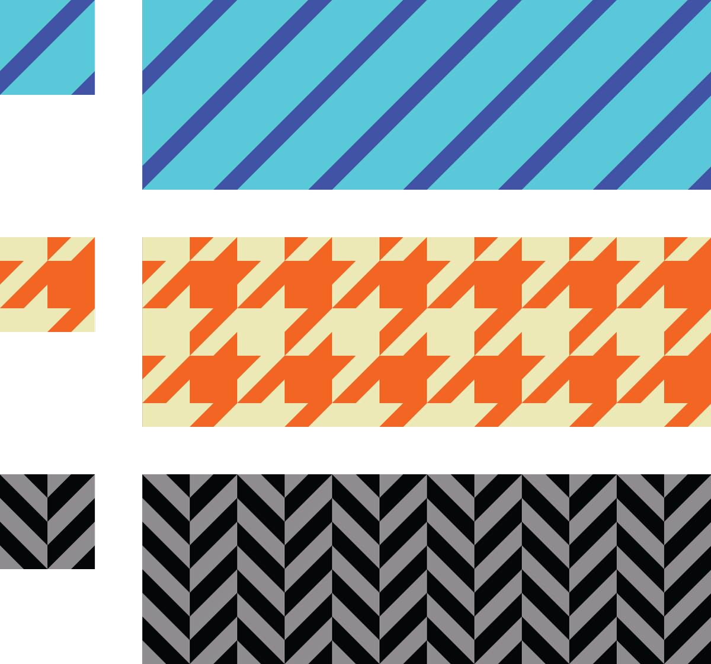
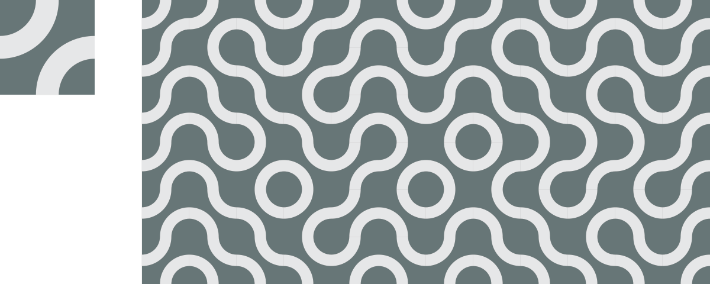
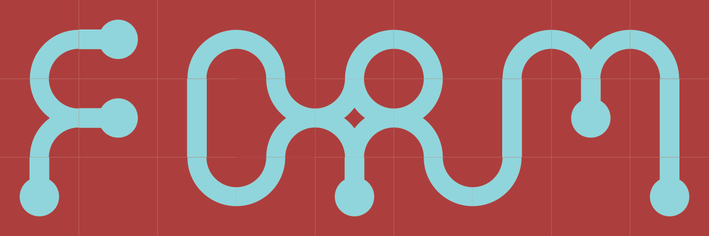

## Tile Maps + Sets

[[
introduction
tiles used in design art
patterns, fonts, visual rhythm, concord, variety, build complexity more easily
tiles in traditional art
literal tiles, patterns, etc
tiles used in videogames
memory conservation, hardware support
show tile based design/games slideshow 
]]
[Unity: Tilemaps](https://docs.unity3d.com/Manual/Tilemap.html)
: Documentation on using Unity's built in tile mapping features.

::: slides .contain
@@include('./slides.yaml')
/::

[[ edit slides, go heavier on games, take out reduncancies ]]

## Designing Tile Sets

[[intro]]
[[descriptions below could use a once-over, and _slight_ ellaboration ]]

### Repeating Tiles

Top matches bottom, left matches right.

{scale}

### Repeating Tiles with Alternates

Top matches bottom, left matches right. Alternate tiles used to break up pattern.

{scale}

### Rotatable Tiles

Top matches bottom, left matches right. These tiles are not rotationally symetric, but rotated tiles still match up nicely.

{scale}

See also: [Truchet Tiles](https://en.wikipedia.org/wiki/Truchet_tiles)

### Edge-matched Tile Sets

A set of tiles where the sides of each tile match up to the opposing side of another tile in the set. Edge-matched tiles are great for forming lines.

{scale}

One way to create a tile set is to consider each edge to be one of two states: occupied or empty. Since there are 4 sides, and each has two states, there will be 4^2 = 16 tiles in the set.

{scale}

Depending on the design, some of these tiles may be rotations of other tiles.

{scale}

In those cases, a smaller set will still work.

{scale}

With a set of tiles, you can start creating forms.

{scale}

A wide variety of looks can be created.

{scale full-width pixel}

Examples above were generated with [this tile mapping tool from cr31](http://www.cr31.co.uk/stagecast/wang/stage.html).

### Corner-matched Tile Sets

You can also create a set by considering the corners to be empty or occupied. Corner-matched tiles are great for forming shapes.

{scale}

{scale full-width}

### Numbering Tiles

[[explane this]]
{scale full-width}

[[this would be a great place for an interactive tile drawing app with code]]

::: .activity

## Tile Set Discussion

- How does this method impact design rhythm, complexity, concord, similarity, repetition?
- How are these design different from/similar to patterns?
- What kind of forms does this method lead to naturally? How can this be embraced/avoided?
- What are the essential elements of this method?
- How does a tile kit like this compare to building kits like lego blocks?
- How does a tile kit compare to a font?
- How does working within constraints impact creativity?
- What are the advantages/disadvantages to working by hand?
- How would variations on the tile work? Staggered? Triangles? Rectangles?
- What if each edge/corner had three states instead of two?
- How could these tiles work in 3 dimensions?

[[ revise above ]]

/::

::: .activity
## Tile Set Workshop

Create an edge-matched tile kit. Use markers on paper squares. Make up a design that allows rotation, this is faster to draw out than a full set. Once you have made your kit, use it to create a variety of forms. Try building out each letter in the alphabet.

The image below shows which tiles you need to make, and how many to make of each.
{scale}

After playing with your set, start experimenting however you wish. Before the end of the class take a picture of your work and post it the class sketch blog.

[[trade tiles with someone else]]

[[revise copy]]

/::

::: .assignment

## Sketch

This is the first assignment and the beginning of your daily posts.

### Base
Daily exercise:
1. Create a new tile set.
2. Use the tile set to create a design.
3. Screengrab or photograph your work and post to the class sketch blog with the hashtag `#tiles`.

Explore a different idea every day. If you need some ideas, consider using one of the following prompts. If you use one of these prompts, include it in your blog post. 

`paper` `pixels` `vectors` `typography` `self-portrait` `3d` `hexagons` `triangles` `photocopier` `big` `huge` `edge` `corner` `pattern` `trade` `teamwork` `stamps` `scissors` `make-things-that-make-things` 

### Challenge: Alphabet
Design a full alphabet using a single tile set. Post an image that shows your font in use.

/::

## Related Links

[cr31: Wang Tile Maze Design](http://www.cr31.co.uk/stagecast/wang/intro.html)
: An absolutely **excellent** resource with lots of information on tile sets, tile maps, and wang titles.

[Jamis BuckMaze Generation](http://www.jamisbuck.org/mazes/)
: Many—*many*—maze generator algorithms complete with step-by-step visualizations from the author of *Mazes for Programmers*.

[Redblob Games: Tile Map Links](http://www-cs-students.stanford.edu/~amitp/gameprog.html#tiles)
: Amit Patel at Red Blob writes great essays on game-programming concepts. Here are his links to tile-map related articles.

