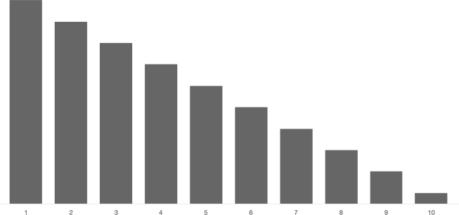
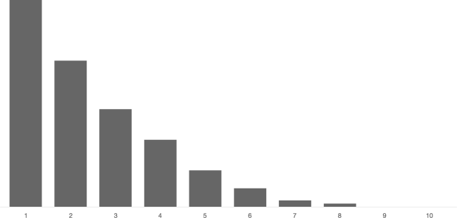
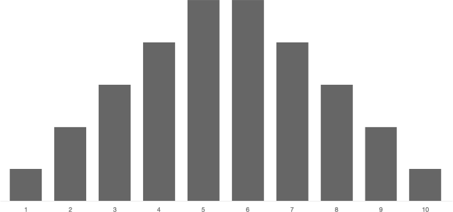
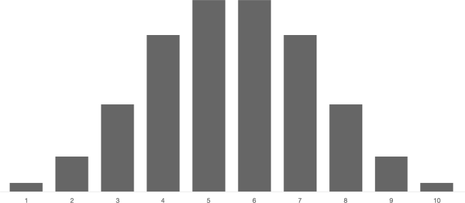

## Random Values

We use the word *random* to mean a variety of related ideas. Depending on context we might mean unplanned, unexpected, unpatterned, uncontrolled, or unpredictable. Random values are a staple of procedural generation systems, often used as the main source of variety. 

Artists began working with randomness and chance long before the invention of computers. These artists must decide how much control of the final piece to maintain, and what aspects of each piece to leave to chance. 

The long-titled, 18th century composition *Instructions for the composition of as many waltzes as one desires with two dice, without understanding anything about music or composition*, [which may have been written](https://en.wikipedia.org/wiki/Musikalisches_W%C3%BCrfelspiel) by Mozart uses chance to select and sequence pre-composed musical phrases. By placing rules on selection and ordering of the phrases, the system ensures that each variation makes musical sense.


Consider the works below:

- Which aspects of each work were influenced by chance?
- Which aspects were controlled by the artist?

::: slides .!short
@@include('./slides.yaml')
/::


## The Methodical Application of Chance

Using random values in your procedural system doesn't mean your results must be haphazard, uncontrolled, or unorganized. While individual random values are unpredictable, you can use these values to create a coherent cumulative effect.

::: .activity
## 2d6 vs 1d12 Chart
Compare the outcomes of rolling 2 6-sided dice to rolling 1 12-sided die.

### Chart One
Roll two six-sided dice 50 times.<br/>
Plot the sums.{bigger}

### Chart Two
Roll a twelve-sided dice 50 times.<br/>
Plot the values.{bigger}

[[ link to worksheet ]]
/::


### Generating Random Numbers

Plain Javascript provides `Math.random()` to generate a random number.

::: .links-sidebar
[MDN<br/>`Math.random()`](https://developer.mozilla.org/en-US/docs/Web/JavaScript/Reference/Global_Objects/Math/random)
/::

> The Math.random() function returns a floating-point, pseudo-random number in the range [0, 1); that is, from 0 (inclusive) up to but not including 1 (exclusive), which you can then scale to your desired range. The implementation selects the initial seed to the random number generation algorithm; it cannot be chosen or reset by the user.

MDN{attrib}


### Specifying a Range

`Math.random()` always gives you a value between 0 and 1. If you want a different range, you can scale and offset the value yourself:

```javascript
random() * range + start

// even distribution between [10 and 15)
random() * 5 + 10 
```

### Random Integers
The `Math.random()` function returns floating point values, but sometimes you want *integers*. The `Math.floor()` function will round a number down, chopping off the decimal part.

```javascript
// roll a standard die
Math.floor(Math.random()*6) + 1;
```

Be careful when generating integers, it is easy to get results that are slightly off. `Math.floor()` rounds down to the nearest integer, so you need to have values that go *above* the highest integer you want returned. 

Also, using `Math.round()` instead of `Math.floor()` can make lead to unevenly distributed results. Using `round()` instead of `floor()` in the example below causes incorrect results: `1` will get picked half as often as it should, and `7` will sometimes get picked and should not.


::: .bad
```javascript
// roll a standard die
// this won't quite work. why?
Math.floor(Math.random()*7);

// this also doesn't quite work. why?
Math.round(Math.random()*6)+1;
```
/::

### p5 `random()`

Processing provides the `random()` function for generating random numbers. Without any parameters, `random()` works very much like `Math.random()` producing numbers between [0 and 1). 


```javascript
console.log("random()");        // random()
console.log(random());          // 0.45...
console.log(random());          // 0.12...
console.log(random());          // 0.37...
```

P5's `random()` function also accepts optional parameters to control the range of the number, so you don't have to do it yourself. 

```
console.log("random(10)");      // random(10) -> range [0, 10)
console.log(random(10));        // 4.89...
console.log(random(10));        // 1.20...
console.log(random(10));        // 6.99...

console.log("random(20, 30)");  // random(20, 30) -> range [20, 30)
console.log(random(20, 30));    // 21.96...
console.log(random(20, 30));    // 20.56...
console.log(random(20, 30));    // 22.36...
```

P5 provides `floor()` which you can use to generate random integers.

```javascript
// roll a standard die
floor(random(0,6)) + 1
// or
floor(random(1,7))
```

::: .bad
```javascript
// this won't quite work. why?
floor(random(1,6))
```
/::


### Biased Distribution
The examples above will produce results evenly distributed across their range.

Often even distribution isn’t what you really want. Often you want to **bias** the results towards the low-end, high-end, or middle. Simple averaging and the `min()` and `max()` functions can help with this.

#### Even Distribution

```javascript
random(1,11)
```
{bigger}

::: .callout
{scale}
/::


#### Low Bias Distribution

Taking the lowest of two or more random numbers will bias the result toward the low-end.

```javascript
min(random(10), random(10))
```
{bigger}

::: .callout
{scale}
/::

The more random numbers you use, the stronger the bias.

```javascript
min(random(10), random(10), random(10), random(10))
```
{bigger}

::: .callout
{scale}
/::


#### High Bias Distribution

Taking the highest of two or more random numbers will bias the result toward the high-end.

```javascript
max(random(10), random(10))
```
{bigger}

::: .callout
{scale}
/::


#### Middle Bias Distribution

Averaging two or more random numbers will bias the resulttoward the middle.

```javascript
(random(1,11) + random(1,11)) / 2
```
{bigger}

::: .callout
{scale}
/::


#### Normal Distribution

::: .links-sidebar
[Wikipedia:<br/> Normal Distribution](https://en.wikipedia.org/wiki/Normal_distribution)
/::

If you generate several random numbers and average them, the result gets close to **normal distribution**. Normal distribution, or Gaussian distribution, is the "bell curve" distribution which is often found in natural systems.

```javascript
(random(1,11) + random(1,11) + random(1,11)) / 3
```
{bigger}

::: .callout
{scale}
/::


::: .links-sidebar
[P5:<br/> `randomGausian()`](https://p5js.org/reference/#/p5/randomGaussian)
/::

::: .callout
**Note:** P5 also provides the `randomGausian()` function for generating numbers with a true normal distribution. With `randomGausian()` the possible values are not clamped to a range, extreme outliers are just really rare.
/::


#### More Info
[Anydice Dice Calculator](http://anydice.com/)

[Anydice: Three Basic Distributions](http://anydice.com/articles/three-basic-distributions/)

[Redblob: Damage Rolls](https://www.redblobgames.com/articles/probability/damage-rolls.html)


### Dice vs. Decks

When you roll a **die**, you get **random values**. You **might get the same value more than once**, and it **might take a long time to get a particular value**.

If you roll a normal die six times, it is unlikely—*about a 1.5% chance*—that you’ll get all six values without repeats. You have a pretty good chance—*about 33%*–of not rolling any 1s. You can be pretty sure—*98.5% sure*—that at least one number won’t appear in six rolls. 

A **deck of cards** works differently. When you pull cards from deck, you don't get random values. You get **values in a random order**. You avoid duplicates, and you know you will have toured all the values when you reach the end of the deck.

#### Dice Visualizer
::: js-lab
/comp_form/random/sketches/dice.js
/::

#### Deck Visualizer
::: js-lab
/comp_form/random/sketches/cards.js
/::


### Modeling a Deck with an Array


::: .links-sidebar
[P5:<br/> `shuffle()`](https://p5js.org/reference/#/p5/shuffle)
/::

p5 provides the `shuffle()` function to randomly reorder and array. Using shuffle we can simulate shuffling a deck, pulling values from it, and reshuffling when we run out.

```javascript
// create an array to hold the possible values
var values = [0, 1, 2, 3, 4, 5, 6, 7, 8, 9];

// create a variable to hold the current position in the deck
var position = 0;

function setup() {
    // shuffle the deck first
    values = shuffle(values);

    // pull as many values as we need
    for(let i = 0; i < 50; i++) {
        console.log(valueFromDeck());
    }
}

function valueFromDeck() {
    // find the value at the current position in the deck
    var v = values[position];

    // change the position for next time
    position++;

    // if we run out of "cards", shuffle and start over from the top
    if (position == values.length) {
        values = shuffle(values);
        position = 0;
    }

    // return the value
    return v;
}
```


### Random Choices

If you want your code to make a decision at random, you can combine `random()` with a conditional—`if`—statement.

```javascript
// do something only half the time
if (random() < .5) {
    console.log("Optional Thing");
}

// do something only 10% of the time
if (random() < .1) {
    console.log("Rare Thing");
}

// another way to do something only 10% of the time
if (random(100) < 10) {
    console.log("Rare Thing");
}
```

With `else` you can pick between two optional things to do.

```javascript
// do one thing, or the other. even odds.
if (random() < .5) {
    console.log("Option A");
} else {
    console.log("Option B");
}
```

With `else if` you can pick between multiple optional things to do.

```javascript
var r = random(100);

if (r < 20) {
    // r is < 20
    console.log("Rare Thing 1 (20%)");
} else if (r < 40){
    // r is >= 20 and < 40
    console.log("Rare Thing 2 (20%)"); 
} else {
    // r is >= 40
    console.log("Normal Thing (60%)");
}
```

A common mistake when following this pattern is calling random multiple times. If you are making 1 choice between several options, you only want to call `random()` once.

**Remember: 1 choice, 1 `random()`**

::: .bad

```javascript
// this code doesn't work as expected
if (random(100) < 20) {
    // Actually a 20% chance
    console.log("Rare Thing 1 (20%)"); 
} else if (random(100) < 40){
    // Actually a 32% chance
    console.log("Rare Thing 2 (20%)");
} else {
    // Actually a 48% chance
    console.log("Normal Thing (60%)"); 
}
```

/::


::: .activity

## Skyline Tactic Match
Study the example city skylines below. Each skyline was made usinga different tactic for picking random values. <br/> Match each skyline to the tactic.

### Tactics
Pure Random, Low Bias, Normal Bias, High Bias, Deck{bigger}

### Skylines
{scale}

{scale}

{scale}

{scale}

{scale}

### Discuss

- Which tactic is the "best"?
- When would you choose to use different types of bias? 
- Where is each type of biases found in the world?

/::


## Pseudo-random vs. Random

Computers are deterministic systems. When a computer is in a particular state and performs a specific instruction, the resulting state will always be the same. **The results are never random.**

So how can `random()` produce a random value? Technically, it can't. It can produce values that *appear to be random*, called **pseudorandom values**. Pseudorandom values appear random—unless you look very closely—but are created by a deterministic process.

A common method to create pseudorandom values is a [Linear Congruential Generator](https://en.wikipedia.org/wiki/Linear_congruential_generator).

LCGs begin with an initial value called the **seed**, then use multipliction, addition, modulus (remainder after division) to derive a new, seemingly random value. Below is a very basic implementation of LCGs so you can see how they work.

::: js-lab
/comp_form/random/sketches/random_lcg.js
/::

For our purposes, it is not really important to understand exactly how the generator works. 

**It is important to understand that the sequence of `random()` numbers is perfectly predictable, if you know the seed.**

### Setting the Random Seed

::: .links-sidebar
[P5:<br/> `randomSeed()`](https://p5js.org/reference/#/p5/randomSeed)
/::


P5 provides `randomSeed()` to set the **seed** used by `random()`. Once you have set the seed, the sequence of values produced by random will always be the same.

::: js-lab
/comp_form/random/sketches/seed.js
/::

Using the seed, you can use random values in your code, but get the same results each time you run your program. This can be a useful feature in many programs and can help with debugging problems.

Be careful when relying on the seed to get random but repeatable results. There are at least two common ways for things to get messed up.

- First, if your program accepts user input, and that input can influence how many times `random()` is called, your program can get off sequence.

- Second, if you change your program and add or remove a call to `random()`, you will alter the sequence.

::: .callout
Javascript does not provide any way for you to set the seed used by `Math.random()`, so if you need to set the seed and are not using p5, you'll need to find and use another Javascript library for generating random numbers.
/::


::: .activity
## Pencil + Paper LCG
Explore how an LCG works by generating pseudorandom values by hand.


[[ link to worksheet ]]
/::


## Study Examples


### Skyline
::: js-lab
/comp_form/random/sketches/skyline.js
/::


### Small Multiples
::: js-lab
/comp_form/random/sketches/small_mult.js
/::

### Grass
::: js-lab
/comp_form/random/sketches/grass.js
/::

### Brownian Motion
::: js-lab
/comp_form/random/sketches/brownian.js
/::

[Wikipedia: Brownian Motion](https://en.wikipedia.org/wiki/Brownian_motion)

### Horizon
::: js-lab
/comp_form/random/sketches/horizon.js
/::


[[ workshop skipped here, should be its own page on setting up p5 ]]


::: .assignment

## Sketch!

### Base
Experiment with procedurally generating images using `random()`. Explore each of the tactics discussed above. Post your results to the Sketchblog.


### Challenge: Master Study
Kasimir Malevich, Mark Rothko, Piet Modrian, Anni Albers all worked with basic shapes, color, and natural media. Create a sketch that generates new works in the style of one of these artists. Pay particular attention to the subtleties and textures of your chosen artist's work. How closely can you recreate these subtleties?

/::

[[ review questions ]]

## Related Links

::: .links
[Mozart Dice](https://en.wikipedia.org/wiki/Musikalisches_W%C3%BCrfelspiel)
[Mozart Dice 2](http://sunsite.univie.ac.at/Mozart/dice/)
[Mozart Dice 3](https://www.youtube.com/watch?v=nFVmh9WNnDw)
[Creative Computing Week 2 Random Drawings](http://pucd2035-e-f15.github.io/class_notes/week_2/class_work.html)
/::