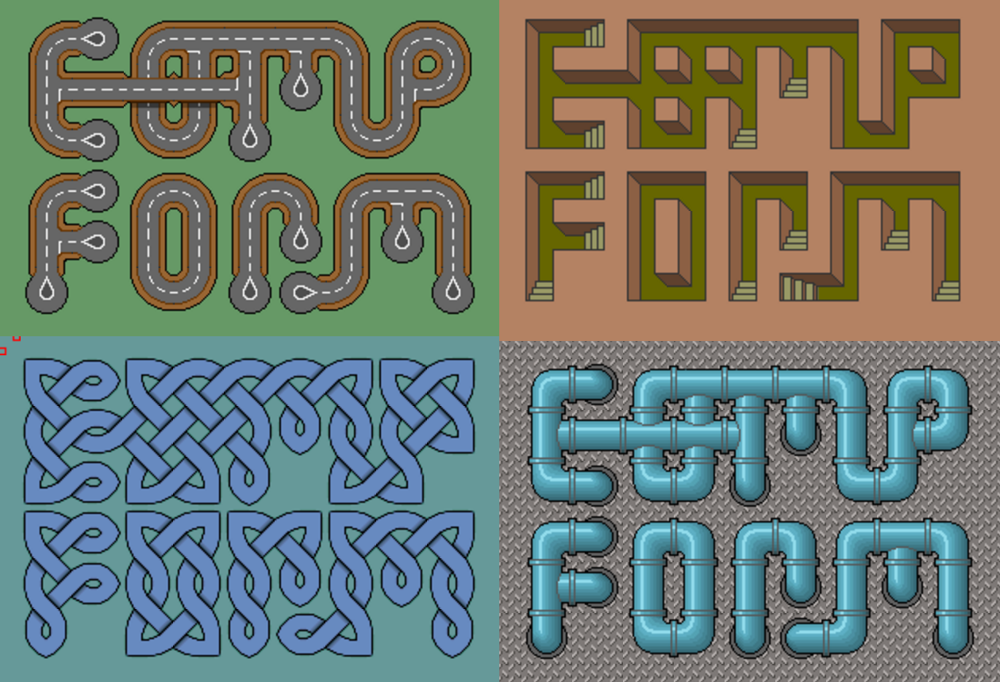
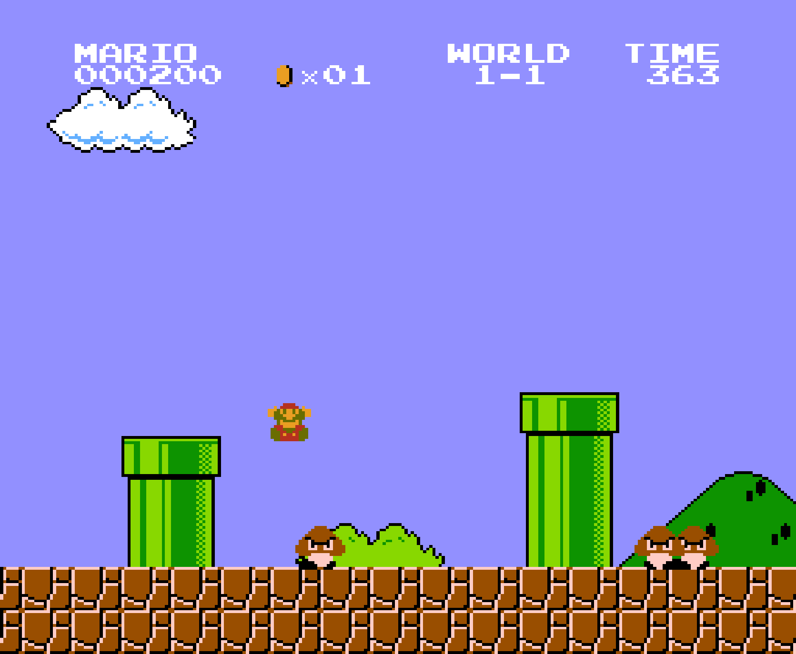
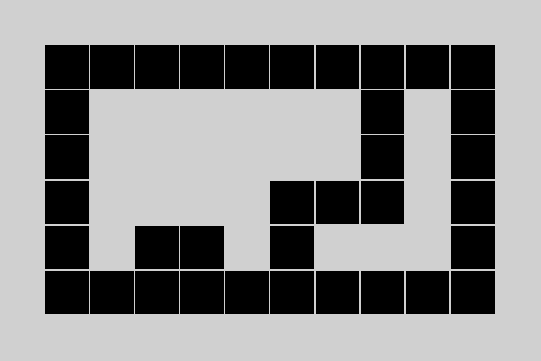
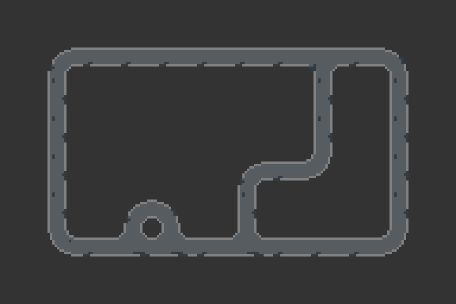

## Tile Maps + Sets

Artists and designers have worked with modular motifs arranged in grids throughout history. This approach affords a variety of aesthetic and practical benefits. Repetition on a grid leads to patterns with natural visual rhythm and concord wile allowing for variety and complexity. Practically, this method allows templates and molds to facilitate mass production of the individual units, which can be arranged contextually on-site. This approach also allows the creative work to be split up: a single artist creates the graphic system, and local craftsmen can apply the system.

You will find examples of this approach in many media including masonry and tile, textiles, font design, and video games. Tile maps and sets were extremely widely used in the 8-bit and 16-bit video game era. Hardware limitation imposed strict limits on designers who took advantage of hardware tile support to push the media forward. Today's games do not face the same hardware restrictions but modular graphic system are still an important tool for artists. Support for tile maps is built into many contemporary game engines, including [Unity](https://docs.unity3d.com/Manual/Tilemap.html).

::: slides .contain
@@include('./slides.yaml')
/::

## Designing Tile Sets

The most basic tile set is a single image. Repeating this image, side by side by side, creates a pattern. With a little care, the image can be designed to match up edge-to-edge creating a pattern where the seams are hidden.

You can build on this simple premise in many ways: alternate tiles, rotatable tiles, complex collections of tiles that work together. You can work with different grids as well; squares are commonly used, but many other [shapes can tessellate](http://gwydir.demon.co.uk/jo/tess/grids.htm) as well.

### Repeating Tiles

The basic repeating tile: top matches bottom, left matches right. Below simple repeating tiles are used to create striped, houndstooth, and herringbone patterns.

{scale}

### Repeating Tiles with Alternates

Top matches bottom, left matches right. Alternate tiles used to break up pattern.

{scale}

### Rotatable Tiles

Top matches bottom, left, and right. Rotated tiles still match up nicely. These are sometimes called See also: [Truchet tiles](https://en.wikipedia.org/wiki/Truchet_tiles).

{scale}

### Edge-matched Tile Sets

A set of tiles where the sides of each tile match up to the opposing side of another tile in the set. Edge-matched tiles are great for forming lines.

{scale}

One way to create a tile set is to consider each edge to be one of two states: occupied or empty. Since there are 4 sides, and each has two states, there will be 4^2 = 16 tiles in the set.

{scale}

Depending on the design, some of these tiles may be rotations of other tiles.

{scale}

In those cases, a smaller set will still work.

{scale}

With a set of tiles, you can start creating forms.

{scale}

A wide variety of looks can be created.

{scale full-width pixel}

Examples above were generated with [this tile mapping tool from cr31](http://www.cr31.co.uk/stagecast/wang/stage.html).

### Corner-matched Tile Sets

You can also create a set by considering the corners to be empty or occupied. Corner-matched tiles are great for forming shapes.

{scale}

{scale full-width}

::: .discussion

## Tile Set Discussion

Discuss the aesthetic and practical features of tile sets and maps.

- How does this method impact design rhythm, complexity, concord, similarity, repetition?
- How are tile maps different from and similar to patterns?
- What kinds of forms does this method lead to naturally? How can this be embraced or avoided?
- What are the essential elements of this method?
- How does a tile kit like this compare to building kits like lego blocks?
- How does a tile kit compare to a font?
- How could these tiles work in 3 dimensions?

<!-- - How does working within constraints impact creativity?
- What are the advantages/disadvantages to working by hand?
- How would variations on the tile work? Staggered? Triangles? Rectangles?
- What if each edge/corner had three states instead of two? -->

/::

::: .activity
## Tile Set Workshop

Create an edge-matched tile kit with markers on paper squares. 

First, create a tile set. Create a design that allows rotation, this is faster to draw out than a full set. The image below shows which tiles you need to make, and how many to make of each.
{scale}

Once you have made your kit, use it to create a variety of forms. Try building out each letter in the alphabet. After playing with your set, start experimenting however you wish. 

Before the end of the class take a picture of your work and **post it the class sketch blog.**

At the end of class, trade your tiles with another student in the class. This week use your partner's tiles to create a sketch, and **post it to the sketch blog.**

### Deliverables

1. Sketch Blog post using your own tile set.
2. Sketch Blog post using your partner's tile set.

/::

## Procedural Tile Mapping

Early computer games were often severely constrained by available storage, memory, and processing power. Super Mario Bros for the NES had only 40 kilobytes of storage for everything: the game code, character and world art, and music. 

This single screenshot mario dying in world 1_1 is 8 kilobytes alone.
{scale  pixel}

This is possible because SMB builds the world from a small set of reusable tiles that can be re-colored and re-used in multiple ways. For example the bush and the cloud in the screenshot above use the same tiles with different palettes. Below is a dump of the tiles and palettes used in SMB.

{scale  pixel}

### 1-bit per Tile

We can pack a map for edge-matched tile sets very efficiently using a single bit for each tile. By comparing the state of adjacent tiles, we can determine which tile should be drawn in each grid position.

::: .two-up

1-Bit Map{figure}

Derived Roadway Drawing{figure}

/::

The roadway image above was produced by following these rules:

::: .callout

1. If the tile is unset, draw nothing.
2. If the tile is set, check the surrounding tiles:
    - If the tile above is also set, add 1 point.
    - If the tile to the right is also set, add 2 points.
    - If the tile below is also set, add 4 points.
    - If the tile to the left is also set, add 8 points.
3. Draw the tile that matches the accumulated points.

/::

{scale}

This point-scheme generates a unique value to every combination of neighboring tile state. 

The following example uses this approach to draw a road using a edge-mapped tile set with a 1-bit map. You can click grid squares to toggle them on and off.

::: js-lab
/tiles/sketches/tilemapper.js
/::

::: .assignment

## Sketch

This is the first assignment and the beginning of your daily posts.

### Base
Daily exercise:
1. Create a new tile set.
2. Use the tile set to create a design.
3. Screengrab or photograph your work and post to the class sketch blog with the hashtag `#tiles`.

Explore a different idea every day. If you need some ideas, consider using one of the following prompts. If you use one of these prompts, include it in your blog post. 

`paper` `pixels` `vectors` `typography` `self-portrait` `3d` `hexagons` `triangles` `photocopier` `big` `huge` `edge` `corner` `pattern` `trade` `teamwork` `stamps` `scissors` `make-things-that-make-things` 

### Challenge: Alphabet
Design a full alphabet using a single tile set. Post an image that shows your font in use.

/::

## Related Links

[cr31: Wang Tile Maze Design](http://www.cr31.co.uk/stagecast/wang/intro.html)
: An absolutely **excellent** resource with lots of information on tile sets, tile maps, and wang titles.

[Jamis BuckMaze Generation](http://www.jamisbuck.org/mazes/)
: Many—*many*—maze generator algorithms complete with step-by-step visualizations from the author of *Mazes for Programmers*.

[Redblob Games: Tile Map Links](http://www-cs-students.stanford.edu/~amitp/gameprog.html#tiles)
: Amit Patel at Red Blob writes great essays on game-programming concepts. Here are his links to tile-map related articles.

[Breaking the NES for Shovel Knight](https://www.gamasutra.com/blogs/DavidDAngelo/20140625/219383/Breaking_the_NES_for_Shovel_Knight.php)
: Shovel Knight is an amazing retro platformer from [Yacht Club Games](http://yachtclubgames.com/). Developer David D'Angelo discusses how the Nintendo's specific technical limitations and abilities influenced Shovel Knight's design.