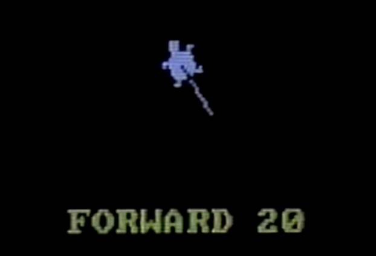
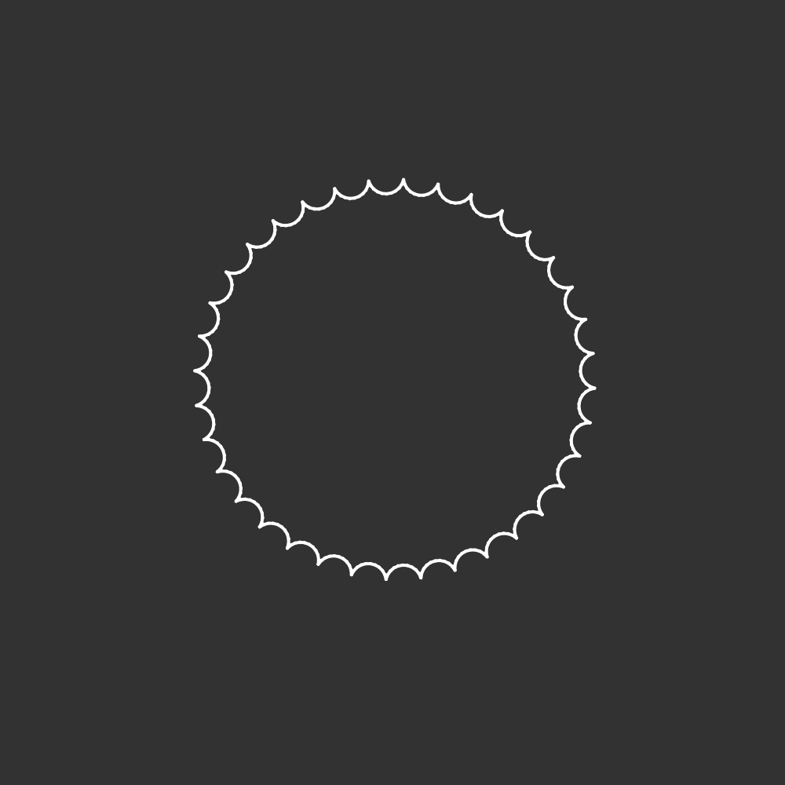

## Logo and Turtle Graphics

The Logo computer programming language was [created in 1967](http://el.media.mit.edu/logo-foundation/what_is_logo/history.html) at the (now) MIT Media Lab to explore how programming can help children learn critical thinking and problem solving. One of the creators of Logo, Seymour Papert, wrote the book [Mindstorms](https://www.amazon.com/Mindstorms-Children-Computers-Powerful-Ideas/dp/0465046746/ref=asap_bc?ie=UTF8) which discusses Logo and its goals.

::: .links-sidebar
[Wikipedia:<br/> Turtle Graphics](https://en.wikipedia.org/wiki/Turtle_graphics)
[MIT: Scratch + Turtles](https://scratch.mit.edu/projects/196503540/)
/::

One of the key ideas introduced in Logo was _turtle graphics_. The turtle was originally a small programmable robot that carried a pen and could trace its path as it moved. Logo could control this turtle with simple commands: `left` and `right` to turn and `forward` to move. This ideas was extended to drawing on screen using a virtual turtle.

::: .two-up

Seymour Papert with a turtle, photo by Cynthia Solomon{figure}


Logo in action{figure}
/::

Logo's use of turtles allows students make a strong association between what happens in the program and how they move their own bodies in the real world. Papert called this _body-syntonic_ learning.

- [Seymour Paper on Learning with Toys (1986)](https://www.youtube.com/watch?v=IhEovwWiniY)
- [Seymour Papert and Students](https://www.youtube.com/watch?v=5dZMgdqy7zY)
- [Seymour Papert and Students (longer cut)](https://www.youtube.com/watch?v=xMzojQFyMo0)
- [Seymour Papert on Logo 4:25 - 6:40](https://youtu.be/ZG9cYhekB8A?t=4m25s)


# A Shift in Perspective
To draw a line in p5.js you might use code like this: 
```javascript
line(100, 100, 200, 200)
```

This priorities the x,y coordinates of the **start** and **end** of the line. The **length** and **angle** of the line are deprioritized; they are not directly specified at all.

Turtle graphics flips this prioritization around. This is code you might write to draw a using a turtle:
```javascript
right(45); forward(100);
```
Now the line's **angle** and **length** are specified instead of its **start** and **end**. This is one of the key shifts in thinking encouraged by turtle graphics. The second shift is apparent if we ask where the line in the second example would be drawn. We can figure out the angle and length of a line from its start and end points, but we can't go the other way. Knowing the length and angle of a line does not tell us where it should be drawn. In turtle graphics, commands like `right` and `forward` use coordinates **relative** to the turtle, rather than **absolute** coordinates measured on the canvas.

This shift in priorities makes some things easier to express and some things harder.


::: .columns

::: .half
**Square, p5.js**
```javascript
rect(100, 100, 100, 100);
```
/::

::: .half
**Square, Turtle Graphics**
```javascript
t.moveTo(100, 100);
t.penDown();
for(side = 0; side < 4; side++) {
    t.forward(100);
    t.turnRight(90);
}
```
/::

/::


::: .columns

::: .half
**Star, p5.js**
```javascript
line(100, 100, 200, 100);
line(200, 100, 119.09, 158.77);
line(119.09, 158.77, 150, 63.67);
line(150, 63.67, 180.90, 158.77);
line(180.90, 158.77, 100.00, 100.00);
```
/::

::: .half
**Star, Turtle Graphics**
```javascript
t.moveTo(100, 100);
t.penDown();
for(side = 0; side < 5; side++) {
    t.forward(100);
    t.turnRight(135);
}
```
/::

/::

Using absolute coordinates works well for drawing a square, but the code for the star is awkward and unclear. Changing the position or size of the start would take a lot of work. With turtle graphics, the code that draws the star mirrors how we might describe the figure.

<!-- ::: js-lab
/turtles/sketches/turtle_star.js
/:: -->


Both frameworks can be used to draw a square or star; we are not _constrained_ to draw specific things by which framework we choose. But the way of thinking encouraged by the frameworks is different.


## Our Simple Turtle

I've created a basic implementation of a turtle for you to use this week.

Grab [the code here](turtle/turtle.html).

### Comp Form Turtle API

`myTurtle = new Turtle(x, y)`

turtle constructor, creates a turtle object
takes optional x, y starting coordinates (default is center of sketch)

`myTurtle.moveForward(distance)`

moves the turtle along its current bearing, drawing a line if pen is down

`myTurtle.moveBackward(distance)`

moves the turtle backward from its current bearing, drawing a line if pen is down

`myTurtle.moveTo(x, y)`

instantly transports the turtle to the provided x, y location, drawing a line if pen is down

`myTurtle.turnRight(angleDegrees)`

rotates the turtle's bearing clockwise by the provided angle in degrees

`myTurtle.turnLeft(angleDegrees)`

rotates the turtle's bearing counter-clockwise by the provided angle in degrees

`myTurtle.turnTo(angleDegrees)`

changes the turtle's bearing to the provided angle in degrees

`myTurtle.penUp()`

tells the turtle to move without drawing

`myTurtle.penDown()`

tells the turtle to draw a line when it moves

`myTurtle.image(image, width, height)`

draws and image centered on the turtle's current location and aligned with the turtle's rotation

`myTurtle.pushState()`

records the turtle’s current state (position, bearing, etc.) to a stack so that changes can be undone easily

`myTurtle.popState()`

restores the turtle’s state to the top recorded state on the stack


::: js-lab
/turtles/sketches/turtle_spiralgraph.js
/::


<!-- 
# Turtle Examples

## Turtle Square Example
<a href="./sketches/turtle_square.js" class="p5_example show-lab show-lab-link hidden">turtle_square</a>

## Turtle Triangle Example
<a href="./sketches/turtle_triangle.js" class="p5_example show-lab show-lab-link hidden">turtle_triangle</a>

## Turtle Multiple Triangles Example
<a href="./sketches/turtle_triangles.js" class="p5_example show-lab show-lab-link hidden">turtle_triangles</a>

## Turtle Spiralgraph Example
<a href="./sketches/turtle_spiralgraph.js" class="p5_example show-lab show-lab-link hidden">turtle_spiralgraph</a>


# In-class Challenge

Explore using p5's pixel manipulation functions by modifying the scripts above. Work through the following challenges in order. Don't skip any.

##

### Modify the Triangle Example
1. Draw a Pentagon.
2. Draw an Octagon.
3. Draw a Circle.
4. Draw a Circle with a dashed line. Tip: `penUp() + penDown()`

### Modify the Multiple Triangles Example
5. Draw each triangle with different colors.
6. Change the triangle function to draw squares.
7. Remove the `.moveTo()` commands.
8. Change the `.turnTo()` commands to `turnLeft(60)`.

Style Tip: If you change what a function does, you should change its name as well. Did you change the function name in 6?

### Modify the Spiralgraph Example
9. Change the `moveForward()` parameter to `i * 3`.
10. Center the result of 11.
11. Comment out the `noLoop()`
12. Change the `turnRight()` parameter to `175 + frameCount`.

### Challenging Challenges
13. Start with the original Triangle Example. Change it to draw a Spiral.
14. Draw two spirals. One Red, one Blue. They should spiral inside each other.
15. Using a loop, draw 10 concentric triangles.
16. Draw this:



### Challenge Self Assessment

After you work with Turtle Graphics this week, you should have a solid grasp on the basics. Consider redoing the challenges above to see how solid your understanding is.

| Time               | Comment                                                                          |
| ------------------ | -------------------------------------------------------------------------------- |
| < 12 in 20 minutes | You need to put in some extra work to strengthen your programming understanding. |
| 12 in 20 minutes   | Good.                                                                            |
| 16 in 30 minutes   | Great.                                                                           |
| 16 in 20 minutes   | Hot Dang!                                                                        |


# Study Examples

## Turtle + Images

<a href="./sketches/turtle_image.js" class="p5_example show-lab show-lab-link hidden">turtle_image</a>


## Turtle Push + Pop

<a href="./sketches/turtle_push.js" class="p5_example show-lab show-lab-link hidden">turtle_push</a>


## Turtle Recursive Tree

<a href="./sketches/turtle_tree.js" class="p5_example show-lab show-lab-link hidden">turtle_tree</a>
 -->


# Assignment
Keep Sketching!

Suggestions:
- Make a crazy spirograph looking thing. Get that out of the way.
- Use a thick, transparent line. Explore building up layers. Recolor in Photoshop with a Gradient Map.
- Create a pre-rendered animation.

## Challenge: Animal Face
Using turtle graphics, create an intricate portrait of an animal. Begin by choosing an animal. Look a photo references of your animal and note interesting details, textures, patterns, and features. How can you translate those details into your sketch. Create you sketch primarily using turtle graphics techniques.
